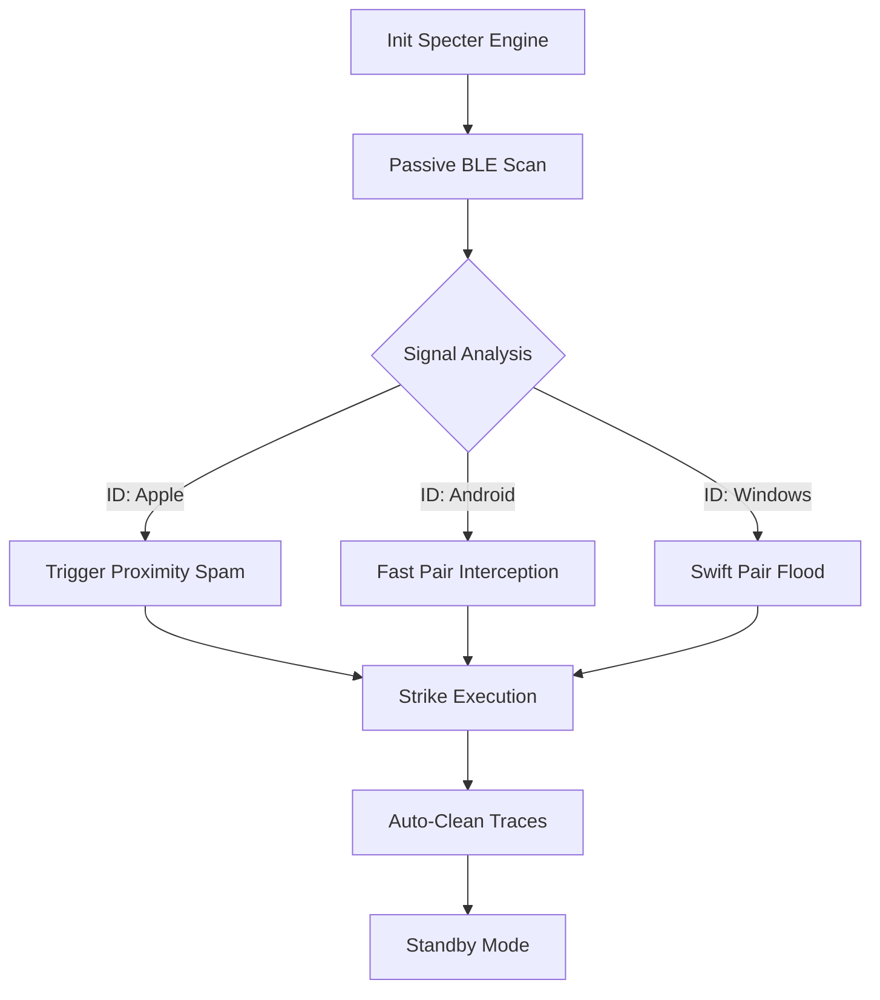

<div align="center">


<p>
  
  
  
  
</p>

---

### 🌐 [ PROJECT STATUS: **ACTIVE STRIKE MODE** ]
**SPECTER STRIKE** represents the pinnacle of wireless reconnaissance. Designed for security operatives, it exploits the fundamental weaknesses of the **Bluetooth Low Energy (BLE)** protocol stack with absolute precision.

---

</div>

## 🧬 QUANTUM-LEVEL CAPABILITIES

<details open>
<summary><b>🔴 TACTICAL RECONNAISSANCE ENGINE</b></summary>
<br>
Utilizes high-frequency polling to unmask randomized MAC addresses and hidden service UUIDs.
<ul>
  <li><b>Zero-Packet Noise:</b> Passive scanning algorithms that remain undetected.</li>
  <li><b>Advanced Fingerprinting:</b> Identification of Apple, Qualcomm, and Broadcom chipsets.</li>
</ul>
</details>

<details>
<summary><b>🔴 PRECISION STRIKE MODULES</b></summary>
<br>
Execute targeted signal manipulation to disrupt or audit proximity-based services.
<ul>
  <li><b>Protocol Flooding:</b> Overloading channels to trigger OS exceptions.</li>
  <li><b>Service Hijacking:</b> Intercepting GATT attributes for deep-level auditing.</li>
</ul>
</details>

---

## 🛰️ OPERATIONAL FLOW-CHART
> This diagram illustrates the high-speed data processing and strike execution sequence of the Phantom Engine.




## 🛠️ OPERATIONAL DIRECTORY (MASTER INDEX)

| COMPONENT | ACCESS LEVEL | DIRECTORY LINK |
| :--- | :--- | :--- |
| ⚡ **CORE WEAPON** | `ROOT` | [**/modules**](./modules) |
| 🛡️ **TECH SPECS** | `S-TIER` | [**/specs**](./specs) |
| 🔬 **INTEL LAB** | `CLASSIFIED` | [**/research**](./research) |
| 📖 **MANUALS** | `OPERATIVE` | [**/docs**](./docs) |
| 🧹 **STEALTH UTILS** | `SYSTEM` | [**/scripts**](./scripts) |

---

## ⚡ DEPLOYMENT PROTOCOL

> **PRE-REQUISITE:** Ensure your Bluetooth Interface is in 'UP' state and you have Root privileges.

#### 1. CLONE THE GHOST SYSTEM
```
git clone https://github.com/karndeepbaror/SpectorStrike
cd SpectorStrike
cd SpectorStrike
```

#### 2. CALIBRATE HARDWARE & DEPENDENCIES
```
sudo chmod +x setup.sh
sudo ./setup.sh
```

#### 3. INITIATE STRIKE SEQUENCE
```
sudo python3 spectorstrike.py
```

## 📊 LIVE REPO TELEMETRY
<p align="center">


</p>

## ⚠️ OPERATIONAL WARNING & LEGAL
> LEGAL NOTICE: This framework is engineered for authorized cybersecurity auditing and educational research. Unauthorized use against private devices is a violation of `international wireless communication laws.` The developer is not responsible for any tactical misuse.
> 
<p align="center">

</p>
<div align="center">
<sub>Developed by <b>Karndeep Baror</b> | Powered by <b>Cryptonic Area Security</b></sub>


</div>

-----
