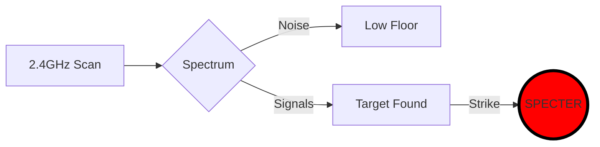
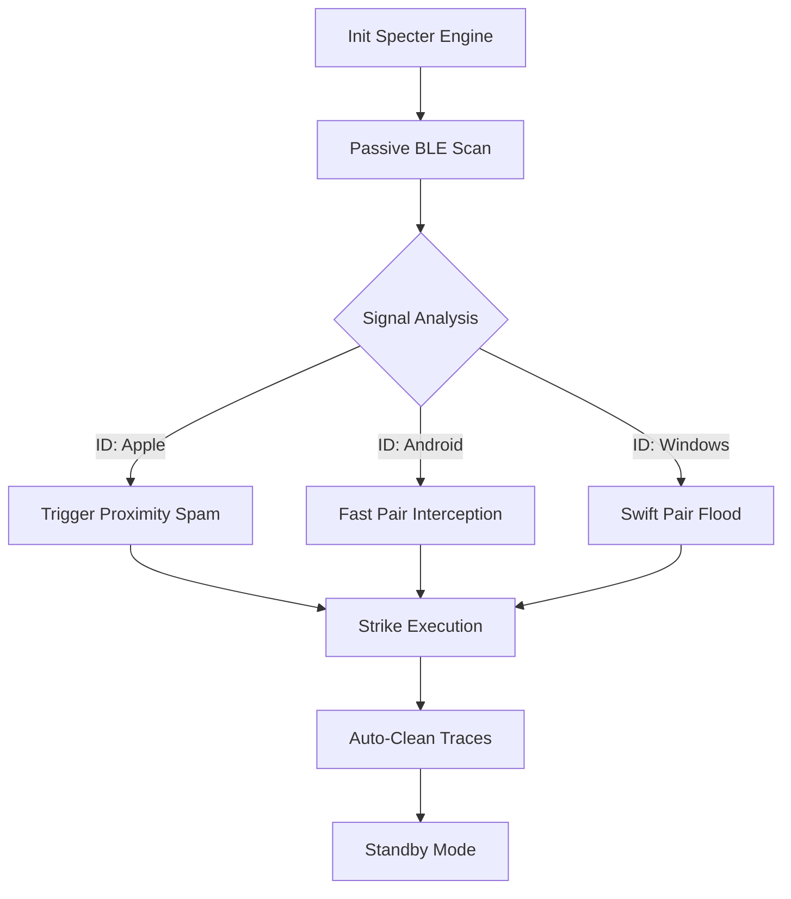

<div align="center">

<div style="background: linear-gradient(90deg, #ff0000, #550000, #000000); padding: 50px 10px; border-radius: 15px; border: 2px solid #ff0000;">
  <h1 align="center" style="margin: 0;">
    <font face="Courier New" size="10" color="#ffffff">
      <b>⚡ SPECTER STRIKE ⚡</b>
    </font>
  </h1>
  <p align="center" style="margin-top: 10px;">
    <font face="Verdana" size="4" color="#ff0000">
      <b>≫ ELITE BLE WARFARE FRAMEWORK ≪</b>
    </font>
  </p>
</div>
<br>
<p align="center">
  
  
  
  
</p>

---
</div>

### 🌐 [ PROJECT STATUS: **ACTIVE STRIKE MODE** ]
**SPECTER STRIKE** represents the pinnacle of wireless reconnaissance. Designed for security operatives, it exploits the fundamental weaknesses of the **Bluetooth Low Energy (BLE)** protocol stack with absolute precision.

---

</div>

## 🧬 QUANTUM-LEVEL CAPABILITIES

<details open>
<summary><b>🔴 TACTICAL RECONNAISSANCE ENGINE</b></summary>
<br>
Utilizes high-frequency polling to unmask randomized MAC addresses and hidden service UUIDs.
<ul>
  <li><b>Zero-Packet Noise:</b> Passive scanning algorithms that remain undetected.</li>
  <li><b>Advanced Fingerprinting:</b> Identification of Apple, Qualcomm, and Broadcom chipsets.</li>
</ul>
</details>

<details>
<summary><b>🔴 PRECISION STRIKE MODULES</b></summary>
<br>
Execute targeted signal manipulation to disrupt or audit proximity-based services.
<ul>
  <li><b>Protocol Flooding:</b> Overloading channels to trigger OS exceptions.</li>
  <li><b>Service Hijacking:</b> Intercepting GATT attributes for deep-level auditing.</li>
</ul>
</details>

---

<div align="center">

| ⚡ SIGNAL OVERRIDE | 🛠️ GATT SHADOWING |
| :--- | :--- |
| <br>Channel Saturation & Disconnection | <br>Attribute Profile Hijacking |

| 🔋 BATTERY DRAIN | ⌨️ HID INJECTION |
| :--- | :--- |
| <br>Forced Discovery Depletion | <br>Remote Keystroke Injection |

</div>

---

## ☣️ ATTACK VECTORS & EXPLOIT DB
> **DATABASE STATUS:** `SYNCHRONIZED` | **THREATS:** `4 CRITICAL`

<div align="center">

| VECTOR ID | TARGET | SEVERITY |
| :--- | :--- | :--- |
| `CVE-iOS-2026` | 📱 **Apple Ecosystem** |  |
| `CVE-BT-AUTO` | 🏎️ **Smart Vehicles** |  |
| `CVE-IOT-LOCK` | 🔓 **Smart Access** |  |
| `CVE-GHOST-W` | ⌚ **Wearables** |  |

</div>

---

## 🛰️ SPECTRUM VISUALIZATION

## 🛰️ OPERATIONAL FLOW-CHART
> _This diagram illustrates the high-speed data processing and strike execution sequence of the Phantom Engine._




## 🛠️ OPERATIONAL DIRECTORY (MASTER INDEX)

| COMPONENT | ACCESS LEVEL | DIRECTORY LINK |
| :--- | :--- | :--- |
| 🛡️ **TECH SPECS** | `S-TIER` | [**/specs**](./specs) |
| 🔬 **INTEL LAB** | `CLASSIFIED` | [**/research**](./research) |
| 📖 **MANUALS** | `OPERATIVE` | [**/docs**](./docs) |
| 🧹 **STEALTH UTILS** | `SYSTEM` | [**/scripts**](./scripts) |

---

## ⚡ DEPLOYMENT PROTOCOL

> **PRE-REQUISITE:** Ensure your Bluetooth Interface is in 'UP' state and you have Root privileges.

#### 1. CLONE THE GHOST SYSTEM
```
git clone https://github.com/karndeepbaror/SpectorStrike
cd SpectorStrike
cd SpectorStrike
```

#### 2. CALIBRATE HARDWARE & DEPENDENCIES
```
sudo chmod +x setup.sh
sudo ./setup.sh
```

#### 3. INITIATE STRIKE SEQUENCE
```
sudo python3 spectorstrike.py
```

## 📊 LIVE REPO TELEMETRY [SENSORS: ACTIVE]
> **SYSTEM DATA:** Analyzing spectral density and protocol integrity.

<div align="center">

| 🛰️ MODULE SYSTEM | 📶 STATUS | ⚡ PERFORMANCE | 💠 PRIORITY |
| :--- | :--- | :--- | :--- |
| **PROXIMITY SCANNER** | `[ ACTIVE ]` |  | `HIGH` |
| **PACKET INJECTOR** | `[ STANDBY ]` |  | `CRITICAL` |
| **FINGERPRINT DB** | `[ SYNCED ]` |  | `NORMAL` |
| **GHOST PROTOCOL** | `[ ENABLED ]` |  | `MAX` |

</div>

<br>

<p align="center">
  
  
</p>

<div align="center">
  <code><b>LOGS:</b> [SYSTEM] [09:42:01] Strike Sequence Loaded... [OK]</code><br>
  <code><b>LOGS:</b> [SYSTEM] [09:42:05] Stealth Mode Handshake Initiated... [OK]</code><br>
  <code><b>LOGS:</b> [SYSTEM] [09:42:10] Waiting for BLE Target Acquisition... [SCANNING]</code>
</div>

---

## ⚠️ OPERATIONAL WARNING & LEGAL PROTOCOL
> **CLASSIFICATION:** `EXTREME RISK` | **JURISDICTION:** `INTERNATIONAL WIRELESS LAW`

<div align="center">
<table border="0">
<tr>
<td>

<br><br>
This framework, <b>SPECTER STRIKE</b>, is engineered exclusively for authorized cybersecurity auditing, penetration testing, and advanced educational research. Accessing or disrupting private wireless devices without explicit prior consent is a violation of <b>International Wireless Communication Laws</b>. 
<br><br>
The developer, <b>Karndeep Baror</b>, and <b>Cryptonic Area Security</b> provide this tool as-is. We assume <u>ZERO LIABILITY</u> for any tactical misuse, data loss, or legal consequences resulting from the deployment of this engine.
<br><br>
<i>"The power of the Phantom must be wielded with absolute responsibility."</i>
</td>
</tr>
</table>
</div>

---

<div align="center">
  <svg width="100%" height="50" viewBox="0 0 1000 50" xmlns="http://www.w3.org/2000/svg">
    <rect width="1000" height="50" fill="#000000" rx="10"/>
    <rect width="1000" height="5" y="45" fill="#ff0000" rx="2"/>
    <text x="50%" y="32" font-family="Arial, sans-serif" font-size="22" font-weight="bold" fill="#ffffff" text-anchor="middle" letter-spacing="3">
      THE DIGITAL PHANTOM IS WATCHING
    </text>
    <animate attributeName="opacity" values="0.5;1;0.5" dur="3s" repeatCount="indefinite" />
  </svg>
</div>

<div align="center">
  <br>
  <p>
    
    
  </p>
  
  <p>
    
    
    
  </p>
  
  <br>
  <sub>© 2026 SPECTER-STRIKE | ALL RIGHTS RESERVED | VERSION 1.0-PHANTOM</sub>
</div>

---
